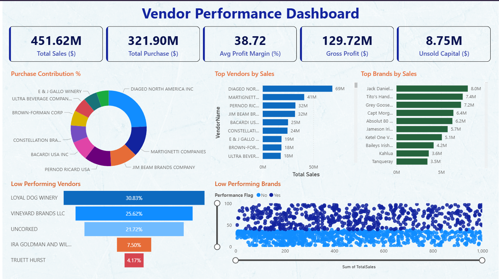

# 📊 Vendor Performance Analysis

> An end-to-end data analytics project for evaluating vendor profitability, pricing optimization, and inventory risk using **SQL**, **Python**, and **Power BI**.

---

## 🗂️ Table of Contents

- [Project Overview](#-project-overview)
- [Business Problem](#-business-problem)
- [Tech Stack](#-tech-stack)
- [Project Structure](#-project-structure)
- [Data Architecture](#-data-architecture)
- [Analysis Breakdown](#-analysis-breakdown)
- [Key Insights](#-key-insights)
- [Statistical Analysis](#-statistical-analysis)
- [Power BI Dashboard](#-power-bi-dashboard)
- [Getting Started](#-getting-started)
- [Results & Recommendations](#-results--recommendations)
- [Future Enhancements](#-future-enhancements)

---

## 📌 Project Overview

This project delivers a comprehensive vendor performance evaluation framework for an inventory-based business. Using a multi-source **SQLite database**, advanced **SQL engineering**, **Python-based statistical analysis**, and an interactive **Power BI dashboard**, the project delivers actionable insights across four domains:

| Domain | Key Question |
|--------|-------------|
| 💰 **Vendor Profitability** | Which vendors deliver the highest gross profit and margin? |
| 🏷️ **Pricing Optimization** | Which products have high margins but low visibility? |
| 📦 **Inventory Risk** | Where is capital locked in unsold inventory? |
| 🚚 **Procurement Efficiency** | Does bulk buying reduce unit costs? |

---

## 🎯 Business Problem

> *"Which vendors are delivering real value — and which are silently draining profitability?"*

Procurement decisions without data-backed vendor benchmarks expose businesses to:
- Unsold inventory buildup and capital lock-up
- Poor vendor margins going undetected
- Missed promotional opportunities for high-margin products
- Freight cost inefficiencies

This project was built to eliminate those blind spots.

---

## 🛠️ Tech Stack

| Technology | Role |
|-----------|------|
|  | Data ingestion, cleaning, EDA, statistical analysis |
|  | Database design, CTE-based query engineering, aggregations |
|  | Interactive business dashboard & visualization |
| `pandas` | Data manipulation, transformation, KPI computation |
| `numpy` | Numerical operations, safe division, array calculations |
| `matplotlib` / `seaborn` | EDA visualizations, Pareto charts, scatter plots |
| `scipy.stats` | Confidence intervals, Two-Sample T-Test |
| `sqlite3` | DB connection, table creation, data persistence |

---

## 📁 Project Structure

```
vendor-performance-analysis/
│
├── 📓 Exploratory_Data_Analysis.ipynb     # EDA, SQL query building, data pipeline
├── 📓 Vendor_Performance_Analysis.ipynb   # Core analysis, visualizations, stats
│
├── 🗄️ inventory.db                        # SQLite database (raw + summary tables)
│
├── 📂 powerbi_data/                       # Exported CSVs for Power BI
│   ├── BrandPerformance.csv
│   ├── PurchaseContribution.csv
│   ├── LowTurnoverVendor.csv
│   └── vendor_sales_summary.csv
│
├── 📂 logs/
│   └── get_vendor_summary.log             # Pipeline run logs
│
├── ingestion_db.py                        # DB ingestion utility module
├── get_vendor_summary.py                  # Main pipeline script (production-ready)
│
└── README.md
```

---

## 🗄️ Data Architecture

### Source Tables (Raw Layer)

The `inventory.db` SQLite database contains four operational tables:

```
purchases          → Purchase transactions (vendor, brand, quantity, price)
sales              → Sales transactions (vendor, brand, sales $, qty, excise tax)
purchase_prices    → Brand reference with purchase price vs. actual (retail) price
vendor_invoice     → Invoice records with freight cost per PO per vendor
```

### Engineered Summary Table

The project's core data output is the **`vendor_sales_summary`** table, built from a multi-CTE SQL query:

```sql
WITH FreightSummary AS (
    SELECT VendorNumber, SUM(Freight) AS FreightCost
    FROM vendor_invoice GROUP BY VendorNumber
),
PurchaseSummary AS (
    SELECT p.VendorNumber, p.VendorName, p.Brand, p.Description,
           p.PurchasePrice, pp.Price AS ActualPrice, pp.Volume,
           SUM(p.Quantity) AS TotalPurchaseQuantity,
           SUM(p.Dollars)  AS TotalPurchaseDollars
    FROM purchases p
    JOIN purchase_prices pp ON p.Brand = pp.Brand
    WHERE p.PurchasePrice > 0
    GROUP BY p.VendorNumber, p.VendorName, p.Brand, p.Description,
             p.PurchasePrice, pp.Price, pp.Volume
),
SalesSummary AS (
    SELECT VendorNo, Brand,
           SUM(SalesQuantity) AS TotalSalesQuantity,
           SUM(SalesDollars)  AS TotalSalesDollars,
           SUM(SalesPrice)    AS TotalSalesPrice,
           SUM(ExciseTax)     AS TotalExciseTax
    FROM sales GROUP BY VendorNo, Brand
)
SELECT ps.*, ss.TotalSalesQuantity, ss.TotalSalesDollars,
       ss.TotalSalesPrice, ss.TotalExciseTax, fs.FreightCost
FROM PurchaseSummary ps
LEFT JOIN SalesSummary ss ON ps.VendorNumber = ss.VendorNo AND ps.Brand = ss.Brand
LEFT JOIN FreightSummary fs ON ps.VendorNumber = fs.VendorNumber
ORDER BY ps.TotalPurchaseDollars DESC;
```

### Derived KPI Columns (Python)

```python
df['GrossProfit']        = df['TotalSalesDollars'] - df['TotalPurchaseDollars']
df['ProfitMargin']       = (df['GrossProfit'] / df['TotalSalesDollars']) * 100
df['StockTurnover']      = df['TotalSalesQuantity'] / df['TotalPurchaseQuantity']
df['SalesPurchaseRatio'] = df['TotalSalesDollars'] / df['TotalPurchaseDollars']
df['UnsoldInventoryValue'] = (df['TotalPurchaseQuantity'] - df['TotalSalesQuantity']) * df['PurchasePrice']
df['UnitPurchasePrice']  = df['TotalPurchaseDollars'] / df['TotalPurchaseQuantity']
```

---

## 🔬 Analysis Breakdown

### 1. 📊 Exploratory Data Analysis
- Distribution plots (histplot + KDE) for all numerical columns — before and after cleaning
- Boxplots for outlier detection across all features
- Correlation heatmap to identify inter-variable relationships
- Count plots for top 10 vendors and brand descriptions

### 2. 🧹 Data Cleaning
- Filtered records: `GrossProfit > 0`, `ProfitMargin > 0`, `TotalSalesQuantity > 0`
- Safe division to prevent `inf` values using `np.where()`
- Replaced all `NaN` / `inf` values with `0`
- Stripped whitespace from `VendorName` and `Description` fields
- Explicit type casting for `Volume` column → `float64`

### 3. 🏆 Vendor & Brand Rankings
- Top 10 vendors by `TotalSalesDollars` with labeled bar charts
- Top 10 brands by cumulative sales
- Custom `format_dollars()` function for M/K formatted display

### 4. 📈 Pareto (Purchase Concentration) Analysis
- Computed `PurchaseContribution%` per vendor
- Dual-axis chart: bar (individual %) + red dashed line (cumulative %)
- Donut chart: Top 10 vendors vs. "Other Vendors" slice

### 5. 🎯 Low Sales / High Margin Brand Targeting
- Scatter plot highlighting target brands in the low-sales × high-margin quadrant
- Thresholds: 15th percentile (sales), 85th percentile (margin)

### 6. 📦 Bulk Purchasing Analysis
- Order size categorized into Small / Medium / Large via `pd.qcut()` (tertiles)
- Boxplot comparison of `UnitPurchasePrice` across order size tiers
- Validates: **larger orders → lower unit prices**

### 7. 💸 Unsold Inventory & Stock Turnover
- Total unsold capital quantified per vendor
- Top 10 vendors ranked by locked capital
- Vendors with `StockTurnover < 1` flagged as inventory risk

---

## 💡 Key Insights

| Insight | Detail |
|---------|--------|
| 📌 **Pareto Concentration** | Top 10 vendors dominate total procurement spend — ideal for bulk renegotiation |
| 🔴 **Capital Lock-up** | Significant unsold inventory value concentrated in specific vendor lines |
| 🟢 **Hidden Margin Gems** | Brands exist with low volume but high margins — prime for promotions |
| 📉 **Freight Anomaly** | Freight cost ranges from $0.09 to $257K+ — logistics consolidation needed |
| ⚡ **Bulk Discounts Confirmed** | Larger order sizes statistically correlate with lower unit purchase prices |
| 🐢 **Slow Movers Flagged** | Vendors with StockTurnover < 1 identified for procurement review |

---

## 📐 Statistical Analysis

### Confidence Interval Analysis

95% confidence intervals were computed for profit margins of top vs. low-performing vendor segments using scipy's t-distribution:

```python
from scipy.stats import ttest_ind
import scipy.stats as stats

def confidence_interval(data, confidence=0.95):
    mean_val = np.mean(data)
    std_err  = np.std(data, ddof=1) / np.sqrt(len(data))
    t_crit   = stats.t.ppf((1 + confidence) / 2, df=len(data) - 1)
    margin   = t_crit * std_err
    return mean_val, mean_val - margin, mean_val + margin
```

### Hypothesis Test

| | |
|--|--|
| **Test** | Two-Sample Welch T-Test (`equal_var=False`) |
| **H₀** | No significant difference in profit margins between top and low vendors |
| **H₁** | Significant difference exists |
| **Significance Level** | α = 0.05 |
| **Result** | ✅ **H₀ Rejected** — p-value < 0.05 |
| **Conclusion** | Statistically significant difference confirmed — top vendors drive meaningfully higher margins |

---

## 📊 Power BI Dashboard

Three CSV files are exported for Power BI consumption:

| File | Contents |
|------|----------|
| `BrandPerformance.csv` | Brand-level aggregates: sales, profit margin, stock turnover, freight |
| `PurchaseContribution.csv` | Vendor-wise % share of total procurement spend |
| `LowTurnoverVendor.csv` | Vendors with `AvgStockTurnover < 1` — inventory risk flags |

**Dashboard Pages:**
- **Page 1 — Vendor Purchase Contribution**: Pareto bar + donut chart
- **Page 2 — Brand Performance**: Scatter plot, profit bar chart, conditional formatting
- **Page 3 — Inventory Risk**: Low-turnover table, KPI cards, slicers



🔗 **[View Live Dashboard](https://app.powerbi.com/view?r=eyJrIjoiZjEwNzA0YjgtYTg2Yi00OGY5LTg4MWEtZGUzZjMxYjFmYTFlIiwidCI6IjJmM2ViMmYzLTIwNjItNGRlOS04MmM5LTA3ZGIzZmFkMGJhNCJ9)**

> ℹ️ Pre-aggregated data exports eliminate Power BI refresh latency and ensure consistent KPI definitions.

---

## 🚀 Getting Started

### Prerequisites

```bash
pip install pandas numpy matplotlib seaborn scipy
```

### Clone & Run

```bash
git clone https://github.com/your-username/vendor-performance-analysis.git
cd vendor-performance-analysis
```

**Step 1: Run the data pipeline**
```bash
python get_vendor_summary.py
```
This will:
- Connect to `inventory.db`
- Execute the multi-CTE SQL query
- Compute all KPI columns
- Save cleaned data to the database and export CSVs

**Step 2: Open Jupyter Notebooks**
```bash
jupyter notebook
```
- Start with `Exploratory_Data_Analysis.ipynb`
- Then open `Vendor_Performance_Analysis.ipynb`

**Step 3: Load Power BI**
- Open Power BI Desktop
- Import CSVs from `powerbi_data/` folder
- Build or refresh the dashboard

### Check Logs
```bash
cat logs/get_vendor_summary.log
```

---

## 📋 Results & Recommendations

### Vendor Management
- ✅ Negotiate volume discounts with top-10 purchase-concentration vendors
- ✅ Diversify supplier base to reduce single-vendor dependency risk
- ✅ Review or delist vendors with persistent StockTurnover < 1

### Pricing & Promotions
- ✅ Launch targeted promotions for high-margin, low-volume brands
- ✅ Audit pricing gaps (ActualPrice >> PurchasePrice but stagnant sales)

### Inventory & Supply Chain
- ✅ Engage vendors with high unsold inventory for return/exchange agreements
- ✅ Consolidate procurement cycles to leverage bulk pricing
- ✅ Audit and renegotiate freight contracts — extreme cost variance present

---

## 🔮 Future Enhancements

- [ ] **Time-Series Analysis**: Vendor performance trends over months/quarters
- [ ] **Demand Forecasting**: Predictive model for StockTurnover by vendor-brand
- [ ] **Automated Pipeline**: Airflow/cron-scheduled refresh of summary tables
- [ ] **Live ERP Integration**: Connect directly to ERP for real-time vendor scorecards
- [ ] **Vendor Scorecard**: Weighted composite score (margin + turnover + freight + reliability)
- [ ] **Anomaly Detection**: Flag unusual freight spikes or sudden sales drops automatically

---

## 👤 Author

Built as a portfolio data analytics project demonstrating end-to-end skills across SQL engineering, Python analysis, and Power BI dashboard design.

---

## 📄 License

This project is open-source for educational and portfolio purposes.

---

<p align="center">
  <b>SQL • Python • Power BI</b><br>
  <i>From raw database to business insights</i>
</p>
